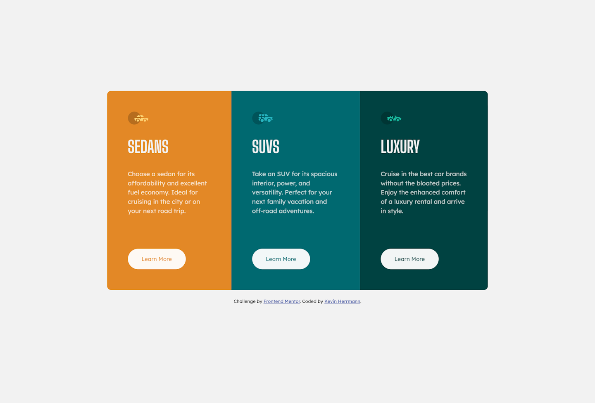

# Frontend Mentor - 3-column preview card component solution

This is a solution to the [3-column preview card component challenge on Frontend Mentor](https://www.frontendmentor.io/challenges/3column-preview-card-component-pH92eAR2-). Frontend Mentor challenges help you improve your coding skills by building realistic projects. 

## Table of contents

- [Overview](#overview)
  - [The challenge](#the-challenge)
  - [Links](#links)
- [My process](#my-process)
  - [Built with](#built-with)
  - [What I learned](#what-i-learned)
- [Author](#author)
- [Screenshot](#screenshot)

## Overview

### The challenge

Users should be able to:

- View the optimal layout depending on their device's screen size
- See hover states for interactive elements

### Links

- Solution URL: [https://github.com/kevinx9000/3-column-preview-card-component/](https://github.com/kevinx9000/3-column-preview-card-component/)
- Live Site URL: [https://kevinx9000.github.io/3-column-preview-card-component/](https://kevinx9000.github.io/3-column-preview-card-component/)

## My process

### Built with

- Semantic HTML5 markup
- CSS custom properties
- Flexbox
- Mobile-first workflow

### What I learned

I started with a desktop-first workflow because I'm typically more comfortable with that, but then switching to create a media query for a mobile layout became an absolute nightmare where I almost gave up. Then I started over with a mobile-first workflow, and based on the previous work I had done, it was a breeze. First time for me that I've used mobile-first and it was actually easier.

## Author

- Frontend Mentor - [@kevinx9000](https://www.frontendmentor.io/profile/kevinx9000)
- Portfolio site - [kevinherrmann.quest](https://kevinherrmann.quest)

## Updates

- 10.16.2023 -- revised and refactored

## Screenshot

